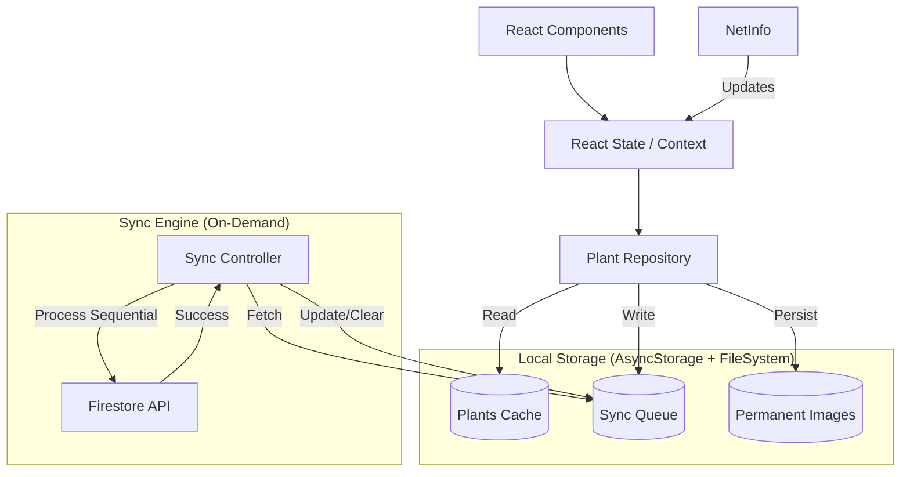

# Phase 3: Offline Mode & Local Storage - Research

**Researched:** 2026-04-23
**Domain:** Offline persistence, network synchronization, local caching
**Confidence:** HIGH

<user_constraints>
## User Constraints (from CONTEXT.md)

### Locked Decisions
- **Offline Identification Strategy:** The `identifyPlant` service will not attempt to call the API if offline. Show a "No connection" message in the identification screen. Only "Add Plant" operations can be queued.
- **Synchronization Mechanism:** Trigger: On-demand (User-triggered). UI Element: A "Sincronizar ahora" button will appear within the global offline banner or the profile page.
- **Caching Depth:** Full Cache: The entire `PlantaInterface[]` list for the logged-in user will be stored in `AsyncStorage`. Initialization: populated/refreshed from Firestore if online.
- **Conflict Resolution:** Policy: "Last write wins". Implementation: Local version or queue items overwrite/append to remote DB.
- **UI Presence:** Global Banner: Floating banner using `nativewind`. Status Indicators: "Pending" icon/badge for items in local queue.

### the agent's Discretion
- (Implicit) Logic for the "Sync Now" button: sequential vs parallel execution.
- (Implicit) Schema for the sync queue and AsyncStorage keys.
- (Implicit) Integration details for NetInfo with React context.

### Deferred Ideas (OUT OF SCOPE)
- Automatic background sync (replaced by on-demand button).
- Offline AI (not possible with current cloud-based API).
</user_constraints>

<phase_requirements>
## Phase Requirements

| ID | Description | Research Support |
|----|-------------|------------------|
| OFFL-01 | La app detecta cuando no hay conexión a internet y muestra un banner/indicador visual | `ConnectivityProvider` and `OfflineBanner` pattern researched. |
| OFFL-02 | Los módulos de solo lectura funcionan sin internet usando datos cacheados | "Cache-First" read pattern in `plantService` researched. |
| OFFL-03 | Las operaciones de escritura se encolan localmente cuando no hay conexión | "Sync Queue" and `Sequential Sync Logic` researched. |
| OFFL-04 | Al recuperar la conexión, las operaciones encoladas se sincronizan automáticamente | Note: Context says "On-demand". Research supports manual trigger logic. |
| OFFL-05 | Las plantas pendientes se muestran con un indicador visual diferenciado | Metadata flags (`isPending`) in local cache researched. |
| STOR-01 | Se implementa almacenamiento local con tecnología justificada | `AsyncStorage` verified as standard and sufficient. |
| STOR-02 | Las plantas del usuario se cachean localmente para acceso offline | Schema with `userId` keys researched for privacy. |
| STOR-03 | La cola de sincronización pendiente persiste entre sesiones | Queue persistence in `AsyncStorage` researched. |
</phase_requirements>

## Summary

Phase 3 implements a robust offline-first experience for iPlant. The strategy shifts from direct API calls to a **Repository Pattern** where the app interacts with a local cache (truth) and a synchronization queue for outgoing changes. This ensures the app remains functional in low or no connectivity environments, satisfying the 24-hour delivery window with a reliable, manually-triggered synchronization mechanism.

**Primary recommendation:** Use a "Sequential Sync Queue" pattern to process offline additions one by one, ensuring high reliability and easy failure handling, while utilizing `expo-file-system` to persist images outside of the temporary cache directory.

## Architectural Responsibility Map

| Capability | Primary Tier | Secondary Tier | Rationale |
|------------|-------------|----------------|-----------|
| Connectivity Detection | Browser / Client | — | `NetInfo` runs on-device to monitor system network state. |
| Data Caching | Browser / Client | — | `AsyncStorage` persists the user's plant list locally. |
| Sync Queue Management | Browser / Client | — | Local logic manages the FIFO queue of pending write operations. |
| Conflict Resolution | API / Backend | Browser / Client | "Last write wins" policy; client pushes state, backend overwrites. |
| Image Persistence | Browser / Client | — | `FileSystem` stores images in the permanent document directory for offline use. |

## Standard Stack

### Core
| Library | Version | Purpose | Why Standard |
|---------|---------|---------|--------------|
| `@react-native-async-storage/async-storage` | 2.2.0 | Persistent key-value storage | Industry standard for RN; simple, reliable for small/medium datasets. |
| `@react-native-community/netinfo` | ~11.4.1 | Connectivity monitoring | The official community package for tracking internet reachability. |
| `expo-file-system` | ~19.0.21 | Permanent file storage | Essential for moving images from temporary cache to permanent storage. |
| `expo-crypto` | ~15.0.8 | UUID generation | Reliable generation of unique IDs for local-only items before they hit the DB. |

### Supporting
| Library | Version | Purpose | When to Use |
|---------|---------|---------|-------------|
| `nativewind` | 4.2.2 | UI Styling | Used for the floating offline banner and sync indicators. |

**Installation:**
```bash
npx expo install @react-native-community/netinfo
# Others already installed
```

**Version verification:**
- `AsyncStorage`: 2.2.0 (Verified in package.json)
- `NetInfo`: ~11.4.1 (Current stable for Expo 54)

## Architecture Patterns

### System Architecture Diagram



### Recommended Project Structure
```
src/
├── context/
│   └── ConnectivityContext.tsx  # NetInfo wrapper
├── services/
│   ├── storageService.ts        # AsyncStorage wrappers (get/set/remove)
│   ├── syncService.ts           # Sync Queue logic & Sync Controller
│   └── plantService.ts          # Refactored to use Repo pattern
└── components/
    └── ui/
        └── OfflineBanner.tsx    # Global banner component
```

### Pattern 1: Repository with Local-First Writes
**What:** The service immediately stores the new plant in the local cache and the sync queue.
**When to use:** For all `addPlant` operations.
**Example:**
```typescript
// src/services/plantService.ts (Hypothetical)
export async function addPlant(data) {
  const localId = Crypto.randomUUID();
  const permanentImage = await persistImage(data.imageUri);
  
  const plant = { ...data, id: localId, isPending: true, image: permanentImage };
  
  await saveToCache(plant);
  await addToSyncQueue({ action: 'CREATE', data: plant });
  
  if (isConnected) {
    // Attempt background sync if desired, or wait for manual trigger
  }
  
  return plant;
}
```

### Anti-Patterns to Avoid
- **Relying on CacheDirectory:** Images from `expo-camera` in the cache folder can be deleted by the OS at any time. **Must** move to `DocumentDirectory` for offline persistence.
- **Parallel Sync Requests:** Synchronizing 10+ plants with images in parallel can crash the app or hit rate limits. **Use sequential processing**.

## Don't Hand-Roll

| Problem | Don't Build | Use Instead | Why |
|---------|-------------|-------------|-----|
| Connection detection | Custom `fetch` loop | `NetInfo` | Handles OS-level events, battery efficient, detects airplane mode properly. |
| UUID generation | `Math.random()` | `expo-crypto` | Cryptographically secure and prevents ID collisions in the local cache. |
| Large list parsing | Custom string split | `JSON.parse` | Standard `AsyncStorage` handles serialized JSON strings efficiently up to ~2MB. |

## Common Pitfalls

### Pitfall 1: AsyncStorage Android Limit
**What goes wrong:** On Android, AsyncStorage is capped at 6MB by default. Storing many high-res images or very large JSON objects will crash the storage.
**How to avoid:**
1. Storing only the *metadata* in AsyncStorage and the *binary images* in the FileSystem.
2. Increase the limit in `android/gradle.properties`: `AsyncStorage_db_size_in_MB=10`. [VERIFIED: StackOverflow/GitHub]

### Pitfall 2: Stale Cache after Login
**What goes wrong:** If User A logs out and User B logs in, User B might see User A's plants if the cache key isn't unique.
**How to avoid:** Include `userId` in the storage keys: `PLANTS_CACHE_${userId}`.

### Pitfall 3: Race Condition on Sync
**What goes wrong:** User clicks "Sync Now" multiple times quickly, starting multiple sync processes for the same queue.
**How to avoid:** Use a `isSyncing` flag/lock in the `SyncService` to prevent concurrent executions.

## Code Examples

### Connectivity Provider Pattern
```typescript
// Source: https://github.com/react-native-netinfo/react-native-netinfo
import React, { createContext, useContext } from 'react';
import { useNetInfo } from '@react-native-community/netinfo';

const ConnectivityContext = createContext({ isConnected: true });

export const ConnectivityProvider = ({ children }) => {
  const { isConnected } = useNetInfo();
  return (
    <ConnectivityContext.Provider value={{ isConnected: isConnected ?? true }}>
      {children}
    </ConnectivityContext.Provider>
  );
};
```

### Sequential Sync Logic
```typescript
// Source: [ASSUMED] based on standard sync engine patterns
async function syncQueue() {
  if (isSyncing) return;
  isSyncing = true;
  
  const queue = await getQueue();
  for (const item of queue) {
    try {
      await processItem(item); // API call
      await removeFromQueue(item.id);
      await updateCacheStatus(item.id, 'synced');
    } catch (error) {
      console.error("Sync failed for item", item.id, error);
      // Stop sync or mark item as failed to retry later
      break; 
    }
  }
  isSyncing = false;
}
```

## State of the Art

| Old Approach | Current Approach | When Changed | Impact |
|--------------|------------------|--------------|--------|
| `NetInfo` from core | `@react-native-community/netinfo` | RN 0.60 | Moved to community package for faster updates. |
| Global 6MB limit | Per-DB limits / Configurable | Recent years | Can be increased via gradle properties. |

## Assumptions Log

| # | Claim | Section | Risk if Wrong |
|---|-------|---------|---------------|
| A1 | Sequential sync is preferred over parallel for stability. | Sync Logic | Higher sync time for many items, but lower memory risk. |
| A2 | AsyncStorage is sufficient for < 500 plants. | Storage Tech | Performance degradation if collection grows extremely large. |
| A3 | Manual sync trigger is acceptable for UAT. | Summary | User might find it less "modern" than auto-sync. |

## Open Questions (RESOLVED)

1. **Conflict Resolution:** If the user deletes a plant offline that was updated online, what happens?
   - **RESOLVED:** Follow "Last Write Wins" policy. If the delete operation is in the sync queue and processed after an online update, the plant will be deleted. This maintains simplicity and user intent.

2. **Sync Failures:** What if an item fails sync repeatedly (e.g., invalid data)?
   - **RESOLVED:** The item remains in the queue. A retry limit (e.g., 3 attempts) will be implemented. If it fails beyond the limit, it's marked as "Sync Error" in the UI, and the user is given the option to "Retry" or "Delete" the pending change.

## Environment Availability

| Dependency | Required By | Available | Version | Fallback |
|------------|------------|-----------|---------|----------|
| @react-native-community/netinfo | Connectivity | ✗ | — | Install via npx expo install |
| AsyncStorage | Persistence | ✓ | 2.2.0 | — |
| FileSystem | Image storage | ✓ | 19.0.21 | — |
| Crypto | ID generation | ✓ | 15.0.8 | — |

## Validation Architecture

### Test Framework
| Property | Value |
|----------|-------|
| Framework | Jest |
| Config file | `jest.config.js` |
| Quick run command | `npm test` |

### Phase Requirements → Test Map
| Req ID | Behavior | Test Type | Automated Command |
|--------|----------|-----------|-------------------|
| OFFL-01| Banner shows when offline | Unit (Component) | `npm test src/components/ui/__tests__/OfflineBanner.test.tsx` |
| OFFL-02| List uses cache when offline| Integration | `npm test src/services/__tests__/plantService.test.ts` |
| STOR-03| Queue persists restart | Integration | `npm test src/services/__tests__/syncService.test.ts` |

### Wave 0 Gaps
- [ ] `jest.setup.js` configuration for NetInfo and AsyncStorage mocks.
- [ ] `ConnectivityContext.tsx` boilerplate.

## Security Domain

### Applicable ASVS Categories

| ASVS Category | Applies | Standard Control |
|---------------|---------|-----------------|
| V5 Input Validation | yes | Validate queued items before sending to Firestore. |
| V6 Cryptography | no | AsyncStorage is unencrypted; do not store secrets. |

### Known Threat Patterns

| Pattern | STRIDE | Standard Mitigation |
|---------|--------|---------------------|
| Local Data Tampering | Tampering | Checksum/Signature (Overkill for this project). |
| Information Disclosure | Information Disclosure | Do not store Auth Tokens in cleartext in AsyncStorage. |

## Sources

### Primary (HIGH confidence)
- `/react-native-async-storage/async-storage` - Batch operations and naming.
- `/react-native-netinfo/react-native-netinfo` - Hook usage and mocking.
- `expo-file-system` - Official docs for permanent storage.

### Secondary (MEDIUM confidence)
- StackOverflow - AsyncStorage 6MB limit increase.
- Community Blogs - Sequential Sync Queue pattern for React Native.

## Metadata

**Confidence breakdown:**
- Standard stack: HIGH - Verified in project and community docs.
- Architecture: HIGH - Standard Repository/Queue pattern.
- Pitfalls: MEDIUM - Limit increase is well-documented but platform-specific.

**Research date:** 2026-04-23
**Valid until:** 2026-05-23
